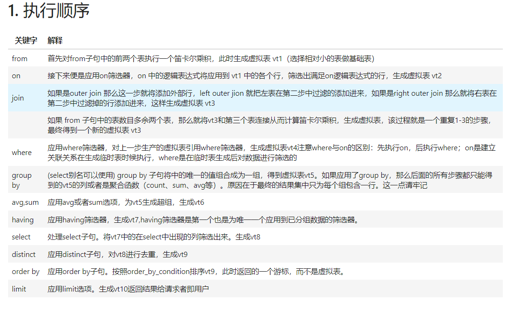

# SQL试题


### <mark style="background-color:red;">1.mysql 操作基础/必知必会</mark>


mysql基础操作



#### 表连接left join\right join\inner join的区别

* 左外连接（left join）：将左表所有的查询信息列出，而右表只列出ON后条件与左表满足的部分，不满足部分使用null填充，连接时注意是否会引入不必要null，是否在表连接后做筛选
* 右外连接（right join）：将右表所有的查询信息列出，而左表只列出ON后条件与右表满足的部分，不满足部分使用null填充
* 内连接（inner join）：两表同时满足ON后的条件的部分才会列出

### <mark style="background-color:red;">2.SQL 执行顺序</mark>

<figure><figcaption><p>mysql执行顺序</p></figcaption></figure>

* SQL去重，用户去重常见方法：distinct ,groupby+count(1)/sum(1)
* 表连接

### <mark style="background-color:red;">3.window function 窗口函数</mark>

:tada::tada:排序窗口函数的区别：

* ROW\_NUMBER()：按照顺序进行排序（1、2、3...）
* RANK()：并列排序，会跳过重复的序号（1、1、3...）
* DENSE\_RANK()：并列排序，不会跳过重复的序号（1、1、2...）


窗口函数


### <mark style="background-color:red;">4. mysql优化 避免全表扫描</mark>

1. 使用select具体字段代替select\*
2. 查询结果数量已知时，使用limit限定
3. 尽量避免使用in和not in（可以使用between和exists）
4. 尽量避免使用or（可用union代替）
5. 尽量避免进行null值判断（可用0去填充然后判断）
6. 大表驱动小表（in的时候左大右小，exists左小右大）
7. join的表不宜过多（一般不超过3个）
8. 先缩小数据范围，再进行其他操作
9. 针对条件筛选列添加索引
10. 使用group by代替distinct进行去重

### 5.常见编程题：查询类、合并类、排序类、字符串提取类

第二高的薪水

留存率:左连接，日期减1,date\_sub(date,inteval 1 day)

<mark style="background-color:red;">时间函数运用：截取日期字段中的有效信息</mark>

* 常用时间函数,year(),month(),day(),date()
* 字符产函数：substr(str\_expression,start,len)=MID(s,start,len)字符产子集截取，注意下标从1开始，或者用left(expression,len),right(expression,len)从左或从右截取字符串
* date\_format(date,'%Y-%m-%d %H:%i:%s')字符产可以定制想要的格式

分数排名

患某种疾病的人

:shark::shark::[连续登录问题](https://www.nowcoder.com/practice/e080f8a685bc4af3b47749ca3310f1fd?tpId=268\&tqId=2286286\&ru=%2Fexam%2Fcompany\&qru=%2Fta%2Fsql-factory-interview%2Fquestion-ranking\&sourceUrl=%2Fexam%2Fcompany)

核心思想：如果连续签到，则签到日期与签到日期的排序差值所得的日期时一样的

解题思路：

1. 排序。按照回答用户分组，回答日期排序，因为一天可能回答多个问题，所以用dense\_rank()

```sql
select author_id ,answer_date,
dense_rank() over (partition by author_id order by answer_date) ranking
from answer_tb
```

2. 作差，用answer\_date减去ranking，得到日期dt(dt判断连续天数，只要连续所有的dt一样

```sql
select t.author_id,
t.answer_date,
t.answer_date-t.ranking dt
from(
    select author_id ,answer_date,
dense_rank() over (partition by author_id order by answer_date) ranking
from answer_tb
) t
```

3. 分组，按照author\_id和dt分组，依照answer\_date去重计数，然后按照连续回答天数的要求选择结果

```sql
select a.author_id,b.author_level,a.days_cnt
from 
(select t1.author_id,
count(distinct t1.answer_date) as days_cnt
from(
#第二步作差
    select t.author_id,
t.answer_date,
t.answer_date-t.ranking dt
from(
#第一步排序
    select author_id ,answer_date,
dense_rank() over (partition by author_id order by answer_date) ranking
from answer_tb
) t
)t1
group by t1.author_id,t1.dt
having count(distinct t1.answer_date)>=3)a
left join author_tb b
on a.author_id=b.author_id
order by a.author_id
```
